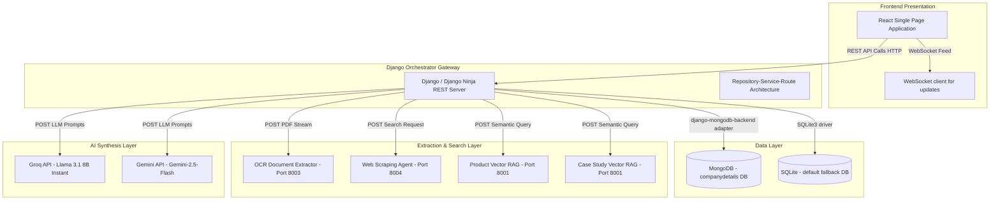
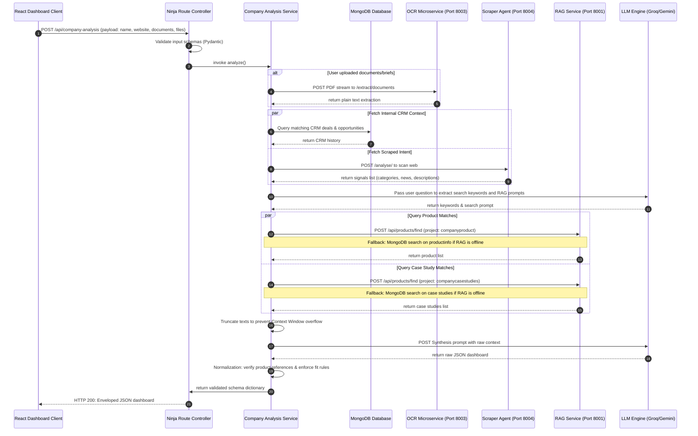
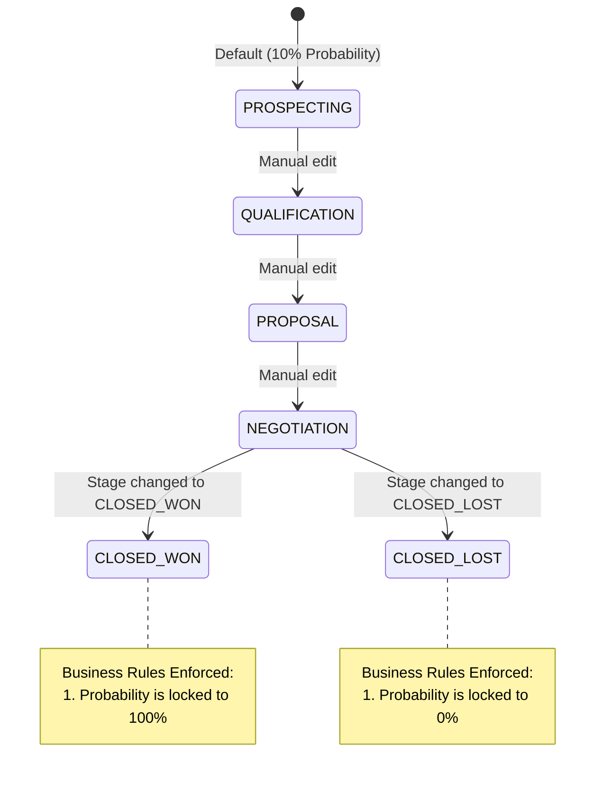

# Software Architecture Document (SAD)
## GrowthlensAI - Enterprise Sales Intelligence Backend

---

## 1. Executive Summary

**GrowthlensAI** is an AI-powered sales enablement and market intelligence platform designed for enterprise sales engineering and account management teams. By aggregating signals from web scraping agents, internal CRM databases, uploaded briefing materials (via OCR), and structured product catalogs, the system synthesizes context-rich preparation dashboards, predicts customer needs, and guides client meetings using an interactive conversational AI Deal Coach.

This document defines the software architecture, design patterns, integration interfaces, data schemas, and request lifecycles of the backend server (`sdc_backend`).

---

## 2. Architectural Principles & Core Goals

The system architecture is governed by four primary design principles:

1.  **Decoupled Repository-Service Pattern:** Direct database queries are restricted to dedicated repository layers. The core business logic resides entirely in service classes, making the application database-agnostic.
2.  **Schema-Driven Type Safety:** All incoming request payloads and outgoing response structures are validated at the route boundaries via Pydantic schemas, eliminating parsing runtime crashes.
3.  **Resilience to Microservice Failures:** The platform integrates with multiple downstream microservices (OCR, Web Agent, RAG). Network timeouts, connection failures, or service outages are treated as non-fatal events, falling back gracefully to local database lookups.
4.  **Deterministic LLM Normalization:** Outputs from LLMs (Groq / Gemini) are structured and post-processed against the local database catalog, ensuring no product hallucinations or score inflation.

---

## 3. System Topology & Architectural Structure

The system is deployed as a microservice-oriented topology, where the Django Ninja backend acts as the central orchestrator:



### Component Port Allocations

-   **Backend Core Gateway (`sdc_backend`):** Port `8000` (or configured via environment)
-   **RAG Search Engine Service:** Port `8001` (provides semantic vector search over Pinecone)
-   **OCR Extraction Service:** Port `8003` (extracts text content from PDFs and images)
-   **Web Scraping & Intent Agent:** Port `8004` (scrapes real-time company news and Sensex highlights)

---

## 4. Feature Module Architecture (RSR Pattern)

The codebase is organized in a flat, highly modular feature structure under the [features/](file:///d:/sdc_backend/features/) directory. Each module adheres to the **Repository-Service-Route (RSR)** pattern:

```
features/
├── callAgents/             # AI Client Q&A interface orchestrating OCR, RAG, and LLMs
├── companyAnalysis/        # Aggregation, scoring, and analysis synthesis routines
├── companydata/            # Low-level Mongo CRUD operations for raw data visualization
├── dashboard/              # Global summary stats and high-level dashboard feeds
├── dealCoach/              # Conversational sales advice engine (interactive deal coach)
├── deals/                  # CRM Pipeline (relational opportunities database)
├── document_generation/    # Word, PDF, and Excel reporting synthesis engine
├── history/                # Direct logging and retrieval of previous research
├── ocr/                    # Direct interfaces to the OCR document parser service
└── signals/                # System signals, events, and action tracking
```

### RSR Layer Roles

1.  **Routes / Controllers (`routes.py`):**
    *   Expose endpoints via Django Ninja router or standard Django views.
    *   Verify payloads using Pydantic request schemas and raise `ValidationError` (returning HTTP 422) on schema mismatch.
    *   Perform initial input sanitization (preventing XSS / SQL Inject).
2.  **Services (`service.py`):**
    *   Encapsulate pure business logic, calculations, and data mutation rules.
    *   Query repositories to retrieve or persist models.
    *   Invoke external integrations and normalize their responses.
3.  **Repositories (`repository.py`):**
    *   Perform raw database queries using the Django ORM.
    *   Raise standardized domain exceptions (e.g. `NotFoundException` instead of Django's `DoesNotExist` or Mongo ID validation errors).
4.  **Models (`models.py`):**
    *   Map data structures directly to database tables.

---

## 5. Detailed Data Dictionary & Schemas

### 5.1. SQL / Relational Data Models (Stored in SQLite/MongoDB Default Engine)

#### A. Signals Model (`signals`)
Tracks intent events, system warnings, and account actions.

| Field Name | Data Type | Constraints / Default | Purpose |
| :--- | :--- | :--- | :--- |
| `id` | `AutoField` | Primary Key, Auto-increment | Identifier |
| `title` | `CharField(255)` | Non-nullable | Title of the signal |
| `source` | `CharField(100)` | Non-nullable, uppercased | Source (e.g. EMAIL, LINKEDIN, SCRAPE) |
| `score` | `IntegerField` | Default: `50` (range: 0-100) | Confidence / Priority score |
| `payload` | `JSONField` | Default: `{}` | Dynamic signal metadata |
| `status` | `CharField(50)` | Default: `"NEW"` | Choices: `NEW`, `PROCESSED`, `ARCHIVED` |
| `created_at` | `DateTimeField` | Auto-now-add | Timestamp of creation |
| `updated_at` | `DateTimeField` | Auto-now | Timestamp of update |

#### B. Deals Model (`deals`)
Tracks sales pipelines, revenue estimations, and win probabilities.

| Field Name | Data Type | Constraints / Default | Purpose |
| :--- | :--- | :--- | :--- |
| `id` | `AutoField` | Primary Key, Auto-increment | Identifier |
| `name` | `CharField(255)` | Non-nullable | Name of sales opportunity |
| `value` | `DecimalField` | Max Digits: `15`, Decimal Places: `2` | Valuation size of deal |
| `stage` | `CharField(50)` | Default: `"PROSPECTING"` | Stages: `PROSPECTING`, `QUALIFICATION`, `PROPOSAL`, `NEGOTIATION`, `CLOSED_WON`, `CLOSED_LOST` |
| `probability`| `IntegerField` | Default: `10` (range: 0-100) | Probability of winning |
| `close_date` | `DateField` | Nullable | Expected target closing date |
| `created_at` | `DateTimeField` | Auto-now-add | Timestamp of creation |
| `updated_at` | `DateTimeField` | Auto-now | Timestamp of update |

---

### 5.2. MongoDB Collections (`companydetails` database)

Static lookup collections and dynamic telemetry logs:

#### A. `product info` & `product details`
*   **Purpose:** Houses the GrowthlensAI product solutions catalog.
*   **Schema Structure:**
    ```json
    {
      "productId": "string (unique SKU)",
      "productName": "string",
      "category": "string",
      "description": "string",
      "price": 12500.00,
      "unit": "string (License / Barrel / Box)",
      "technology": "string",
      "esgImpact": "string (carbon reduction / water conservation)",
      "application": "string"
    }
    ```

#### B. `case studies`
*   **Purpose:** Stores past customer success stories.
*   **Schema Structure:**
    ```json
    {
      "caseStudyId": "string (unique ID)",
      "title": "string",
      "client": "string (past customer)",
      "industry": "string",
      "challenge": "string",
      "solution": "string",
      "productsUsed": ["productName1", "productName2"],
      "results": "string"
    }
    ```

#### C. CRM Records
*   **Purpose:** Stores historical CRM interactions, touchpoints, and account leads.
*   **Schema Structure:**
    ```json
    {
      "crmRecordId": "string",
      "companyName": "string",
      "estimatedDealValue": 2500000.00,
      "dealStage": "string",
      "notes": "string",
      "lastContactDate": "string (ISO Date)"
    }
    ```

#### D. Opportunity History
*   **Purpose:** Logs details on active enterprise upgrade tracks.
*   **Schema Structure:**
    ```json
    {
      "opportunityId": "string",
      "companyName": "string",
      "winProbability": 85,
      "dealValue": 1200000.00,
      "nextAction": "string"
    }
    ```

#### E. `search_history`
*   **Purpose:** Stores search analytics and audit log feeds.
*   **Schema Structure:**
    ```json
    {
      "name": "string",
      "industry": "string",
      "date": "string (YYYY-MM-DD)",
      "status": "string (Analyzed / Pending)",
      "trend": "string (Up / Down)",
      "score": 92
    }
    ```

---

## 6. Key Request Lifecycles & Data Flows

### 6.1. End-to-End Company Analysis request Flow

This sequence chart describes the data aggregation and LLM synthesis lifecycle during a company analysis request:



### 6.2. Deal Probability Stage Machine

Updates to the stage of a deal dynamically affect its win probability:



---

## 7. API Interface Reference

All endpoints return a standardized success or error wrapper:

**Unified Success Wrapper:**
```json
{
  "success": true,
  "data": {},
  "error": null,
  "timestamp": "2026-06-18T16:00:00+00:00"
}
```

**Unified Error Wrapper:**
```json
{
  "success": false,
  "data": null,
  "error": {
    "message": "Meaningful error message details",
    "code": "ERROR_CODE_CONSTANT",
    "details": {}
  },
  "timestamp": "2026-06-18T16:00:00+00:00"
}
```

### Endpoint Routing Matrix

| Route Path | Method | Expected Request Payload | Business Rules Enforced |
| :--- | :--- | :--- | :--- |
| `/api/signals` | `GET` | Query parameters: `status`, `source`, `page`, `limit` | Capped page size (`100`). Paginated list. |
| `/api/signals` | `POST` | `{ title: str, source: str, score: int, payload: dict }` | Sanitize title & source. Force source to uppercase. |
| `/api/deals` | `GET` | Query parameters: `stage`, `min_value`, `page`, `limit` | Paginated CRM deals. |
| `/api/deals` | `POST` | `{ name: str, value: float, stage: str, probability: int }` | Validates stage. Forces probability sync on stage win/loss. |
| `/api/company-analysis` | `POST` | `{ account_id: str, company_name: str, website_url: str, documents: list }` | Aggregates microservice details. Filters allowed products based on sustainability signals. |
| `/api/company-analysis/deal-coach` | `POST` | `{ company_name: str, message: str, analysis_context: dict }` | Prompts conversational assistant with gathered customer signals. |
| `/api/question` | `POST` | `{ company_name: str, question: str, documents: list }` | Direct Q&A endpoint for call agents, compiling OCR and RAG context. |
| `/api/dashboard` | `GET` | None | Returns summary metrics, target accounts, and current scraper alerts. |
| `/api/ocr/extract` | `POST` | `{ url: str }` | Submits a remote URL to the OCR backend for processing. |
| `/api/ocr/extract/documents` | `POST` | Multipart Form: File Streams | Submits raw files directly to the OCR microservice. |
| `/api/companydata/all` | `GET` | Query: `limit_per_collection` | Dumps raw contents of the entire MongoDB DB for debugging. |
| `/api/companydata/{col}/{id}` | `PUT` | Document dictionary payload | Edits MongoDB values in place. Triggers partial matches update. |
| `/api/generate-document` | `POST` | `{ company: str, documentType: str }` | Triggers file generation (formats: docx, pdf, xlsx). |
| `/api/history` | `GET` | None | Returns historical search analytics. |
| `/api/history` | `DELETE` | None | Clears the `search_history` collection. |

---

## 8. Resilience, Sanitization, & Verification Strategy

### 8.1. Input Sanitization
Every textual parameter processed by Routes or Services is sanitized via `clean_input_string()` to prevent XSS injection. Special characters (e.g. `<`, `>`, `&`, `"`, `'`) are converted to safe HTML entities before database entry or external propagation.

### 8.2. RAG Microservice Fallback Engine
When the RAG microservices (on port 8001) are offline or return errors, the backend triggers local database search algorithms:
1.  **Extract Search Terms:** Combines company metadata, scraping signals, and client products into a text blob.
2.  **Clean and Tokenize:** Normalizes the string, removes stopwords, and breaks it into search terms.
3.  **Local Product Matcher:** Queries the MongoDB collections (`productinfo` and `product details`), calculates keyword overlap relevance scores, filters products via `_product_allowed_by_company_evidence` (filtering out water/emissions/carbon products unless matching client evidence exists), and returns the top 5 matches.
4.  **Local Case Study Matcher:** Queries the `case studies` collection and scores match overlap against company metadata, returning the top 5 matches.

### 8.3. LLM Safety Normalization Layer
To guarantee LLM integrity:
*   **Strategic Fit Constraint:** If the context holds fewer than 2 distinct evidence points, the strategic fit score is forced to `null`, `alignment_level` to `"insufficient_evidence"`, and `confidence` to `0`.
*   **Product Hallucination Filter:** Any recommendation inside `solution_mapping` must be validated against the `product_matches` list in context. Product entries not found in the matches list are stripped, preventing the model from recommending unverified solutions.
*   **Numeric Deal Value Sanitation:** Any non-string or numeric `0` values returned for deals inside `solution_mapping` are cleaned to `null`, protecting downstream UI price calculators.

### 8.4. Document Generation Engine
The document generation module (`features/document_generation`) supports three high-fidelity enterprise outputs:
1.  **Word Processing (DOCX):** Utilizes `python-docx` for margin control (1-inch margins), typography hierarchy (Segoe UI, Title: 24pt, Headings: 14pt bold in Royal Blue, Body: 11pt Slate), and custom bullet layout lists.
2.  **Portable Document Format (PDF):** Leverages `reportlab` with exact lead spacing calculations (`leading = fontSize * 1.2` guidelines) to prevent overlapping lines. Integrates paragraph flow boundaries and separator borders.
3.  **Spreadsheets (Excel):** Utilizes `openpyxl` to generate formatted opportunity sheets. Enforces cell format boundaries (e.g. converting `value` to raw decimals and applying currency templates `"$#,##0"` or percentages `"0%"`), alternate row backgrounds (`#F8FAFC`), gridlines display, and auto-computed column widths.

---

## 9. Environment Variables Reference

| Variable Name | Data Type | Default Value | Purpose |
| :--- | :--- | :--- | :--- |
| `DEBUG` | `Boolean` | `True` | Django debug toggle |
| `DATABASE_URL` | `String` | `mongodb://...` | Connection URI for the main database layer |
| `MONGODB_URI` | `String` | `mongodb+srv://...` | Connection URI fallback for client MongoDB |
| `MONGO_DB_NAME` | `String` | `"testdb"` | MongoDB database target name |
| `AGENT_MICROSERVICE_BASE_URL` | `String` | `http://127.0.0.1:8004` | Endpoint base for the scraper microservice |
| `PRODUCT_RAG_MICROSERVICE_BASE_URL` | `String` | `http://127.0.0.1:8001` | Endpoint base for RAG service |
| `PRODUCT_RAG_PROJECT_ID` | `String` | `"companyproduct"` | Vector database profile for products lookup |
| `CASE_STUDY_RAG_PROJECT_ID` | `String` | `"companycasestudies"` | Vector database profile for case studies lookup |
| `OCR_MICROSERVICE_BASE_URL` | `String` | `http://127.0.0.1:8003` | Endpoint base for PDF extraction service |
| `LLM_PROVIDER` | `String` | `"gemini"` | Active LLM model provider (`gemini` / `groq`) |
| `GEMINI_API_KEY` | `String` | `AIzaSy...` | API key authentication for Google Gemini |
| `GROQ_API_KEY` | `String` | `gsk_...` | API key authentication for Groq completions |
| `GEMINI_TIMEOUT` | `Integer` | `60` | Network request read timeout limit |
