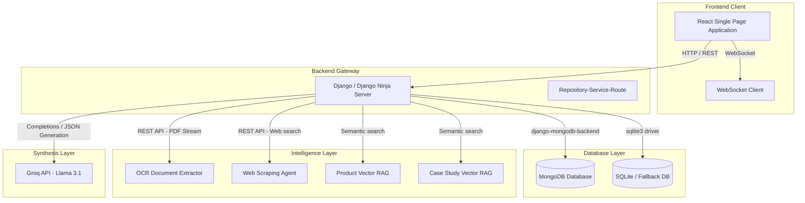
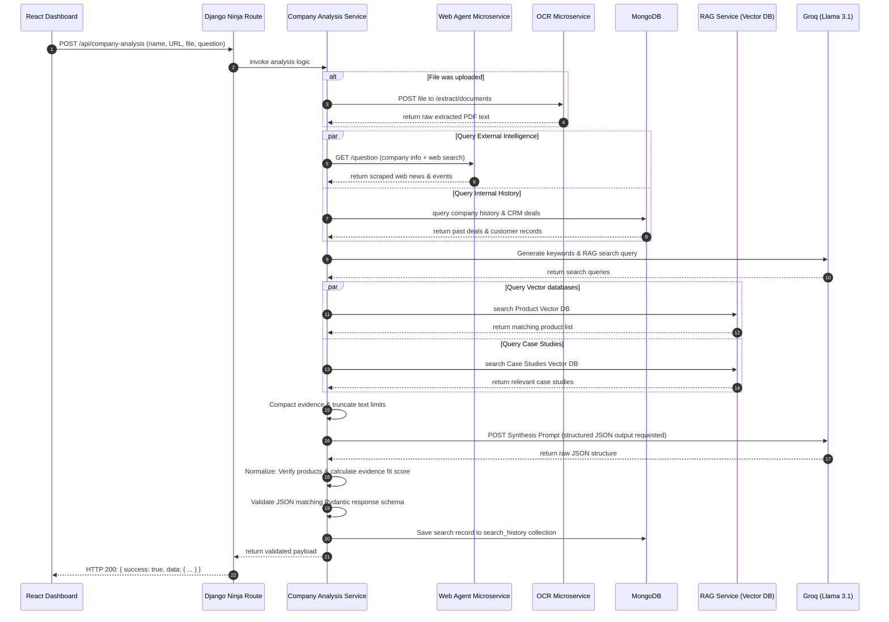
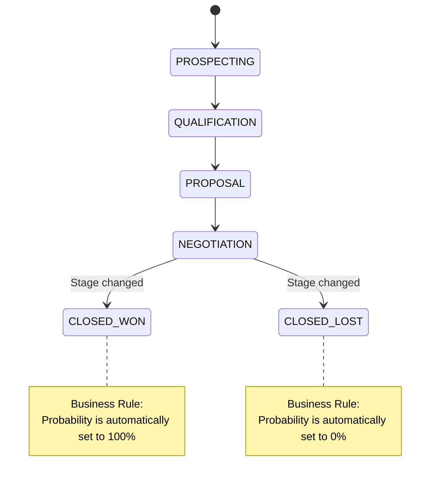

# Software Architecture Document (SAD)
## AI-Enabled Sales Intelligence System

This document outlines the software architecture, design patterns, technology stacks, and data flows of the **Sales Intelligence Application**. The system consists of a modular React frontend (`ai_sales_frontend`) and a Django Ninja backend (`sdc_backend`) backed by MongoDB and integrated with vector RAG, OCR, Web Search Agent microservices, and Groq LLM services.

---

## 1. Architectural Overview

The Sales Intelligence platform is designed to assist enterprise sales teams by aggregating and analyzing company data, sales pipelines, signals, and live market intelligence. It uses Retrieval-Augmented Generation (RAG) and Large Language Models (LLMs) to synthesize sales preparation dashboards, deal insights, and playbooks.

### System Topology Diagram
The system is built on a distributed microservice-oriented topology:



---

## 2. Technology Stack & Environment

### Frontend Client (`ai_sales_frontend`)
*   **Core Framework:** React 18
*   **Build/Bundler Tool:** Vite 5
*   **Styling Engine:** Tailwind CSS, PostCSS, Autoprefixer
*   **Navigation & Routing:** React Router DOM v6
*   **Icon Library:** Lucide React
*   **State Management:** Stores & Context abstractions (stubs for authentication, opportunity details, chat logs, account metrics)
*   **Real-time Communication:** Native WebSocket integrations for chat/notifications

### Backend Server (`sdc_backend`)
*   **Web Framework:** Django 5
*   **API Framework:** Django Ninja (Fast API with Pydantic typing, automatic OpenAPI/Swagger docs generation)
*   **Python Engine:** Python 3.10+
*   **ORM Adapter:** `django-mongodb-backend` for native MongoDB access alongside standard Django ORM
*   **Key Libraries:** Pydantic (data validation), `python-dotenv` (configuration management), `requests` (microservice HTTP caller)

### Core Integrations & Downstream Microservices
1.  **Groq API (Llama 3.1 8B Instant):** Performs natural language question processing, RAG prompt generation, and synthesizes structured JSON payloads for dashboard display.
2.  **OCR Microservice:** Extracts plain text from uploaded PDF/Docx files during question flows.
3.  **Web Agent Microservice:** Queries live search engines and scrapes public company information (executives, news, events).
4.  **Product & Case Study RAG Microservices:** Provides vector search capabilities against custom product catalogs and successful customer case studies.

---

## 3. Architecture Patterns

### Backend Pattern: Repository-Service-Route (Controller)
To enforce a clear separation of concerns, the backend organizes each business feature into a decoupled triad:
1.  **Models (`models.py`):** Define standard database structures using Django ORM.
2.  **Repositories (`repository.py`):** Encapsulate all database CRUD operations. The service layer never interacts with the database directly, making it easy to swap database layers (e.g., SQLite to MongoDB).
3.  **Services (`service.py`):** Contain all core business logic, input validation rules, external API payload compilation, and data normalization.
4.  **Routes/Controllers (`routes.py`):** Define the Django Ninja API endpoints. They parse query parameters, validate request payloads using Pydantic schemas, invoke the appropriate services, and return standard JSON responses.

### Frontend Pattern: Component & Module Separation
The React codebase separates views, charts, dynamic state, and APIs:
*   **`pages/`:** Handles page layouts, view templates, and high-level routing entry points.
*   **`charts/`:** Encapsulates visualizations (Deal pipelines, Revenue trends, Opportunity heatmaps, Hiring trend charts).
*   **`services/`:** Isolates API fetch calls, ensuring UI files never contain hardcoded endpoint logic.
*   **`store/`:** Centralized state management stubs for handling account, deal, chat, and auth statuses globally.
*   **`websocket/`:** Handles sockets for chat and notifications independently.

---

## 4. Key Request Lifecycles & Data Flows

### Detailed End-to-End Analysis Request Cycle
When a salesperson requests a "Company Analysis Dashboard" for a prospective company, the backend performs the following execution chain:



### Deal Stage Probability Synchronization Flow
When a user updates a CRM deal, business rules are enforced automatically at the service layer:



---

## 5. Directory Structure & Key Components

### Backend Modules Structure (`d:\sdc_backend`)
```text
sdc_backend/
├── config/                     # Configuration entrypoint
│   ├── settings.py             # Database backends, secret keys, microservice URLs
│   └── urls.py                 # API Routing, NinjaAPI configuration
├── common/                     # Utility layer
│   ├── exception/              # Global exceptions and HTTP status mappings
│   ├── response/               # Standard Success/Error envelope builders
│   └── utils/                  # String cleaning (XSS block) and param parsing
└── features/                   # Core business features
    ├── signals/                # User intent signals feed
    ├── deals/                  # CRM Deal management (stages & probability synchronization)
    ├── callAgents/             # Core microservice interface & semantic query synthesizer
    ├── companydata/            # Lookup helper for static company tables
    └── companyAnalysis/        # AI-driven enterprise dashboard generator & Chat Deal Coach
```

### Frontend Modules Structure (`d:\sdc_frontend`)
```text
sdc_frontend/
├── src/
│   ├── layouts/                # Wrapper structures (e.g. MainLayout)
│   ├── pages/                  # Views: Dashboard, Inventory, Account, LandingPage, Settings
│   ├── charts/                 # DealPipeline, RevenueTrend, Opportunity charts
│   ├── ai/                     # UI components for OpportunityScoring, AgentWorkflow, RagPipeline
│   ├── services/               # API Clients: authService, chatService, opportunityService
│   ├── store/                  # Global state containers (authStore, opportunityStore, etc.)
│   ├── hooks/                  # Custom React Hooks (useAuth, useOpportunities, useChat)
│   ├── websocket/              # WebSocket listeners (chatSocket, notificationSocket)
│   └── utils/                  # Constants, validators, and currency/number formatters
```

---

## 6. API Interface Reference

All responses follow the unified envelope shape:

**Success Shape:**
```json
{
  "success": true,
  "data": {},
  "error": null,
  "timestamp": "2026-06-18T12:00:00+00:00"
}
```

**Error Shape:**
```json
{
  "success": false,
  "data": null,
  "error": {
    "message": "Error details descriptive text",
    "code": "ERROR_CODE_IDENTIFIER",
    "details": {}
  },
  "timestamp": "2026-06-18T12:00:00+00:00"
}
```

### Mounted Routes Summary

| Endpoint | Method | Payload / Form-Data | Description | Business Rules |
| :--- | :--- | :--- | :--- | :--- |
| `/api/signals` | `GET` | Query filters: `status`, `source`, `page`, `limit` | Lists sales signals with pagination. | `limit` is capped at `100`. |
| `/api/signals` | `POST` | `{ title, source, score, payload }` | Creates a new sales signal. | `title` & `source` trimmed and HTML-escaped. `source` is uppercased. |
| `/api/deals` | `GET` | Query filters: `stage`, `min_value`, `page`, `limit` | Lists CRM deals. | Paginated results. |
| `/api/deals` | `POST` | `{ name, value, stage, probability, close_date }` | Creates a new deal. | Changing stage to `CLOSED_WON` forces probability to `100`. `CLOSED_LOST` forces it to `0`. |
| `/api/question` | `POST` | Multipart/Form-Data: `account_id`, `company_name`, `file` (optional) | Processes questions using internal company details and RAG. | Groq credentials must be present. OCR fails fast if file is uploaded but unreadable. |
| `/api/company-analysis` | `POST` | `{ account_id, company_name, website_url, documents, question }` | Renders the main intelligence dashboard. | Compacts downstream context. Safe-check: suggests only real products. Calculates strategic fit. |
| `/api/company-analysis/deal-coach` | `POST` | `{ company_name, account_id, message }` | Real-time chat dialogue helper for pitch preparation. | Uses compact history & current deal context. |

---

## 7. Security and Validation Strategy

1.  **Input Sanitation:** The backend processes all text strings via `clean_input_string()`, which performs HTML escaping. This neutralizes cross-site scripting (XSS) attacks by transforming characters like `<` and `>` into their safe entity representation.
2.  **Schema Enforcement:** Pydantic is used at both request and response layers. Unvalidated or malformed JSON payload data is rejected at the API gateway layer, throwing a `422 Unprocessable Entity` response and preventing database pollution or type safety errors.
3.  **LLM Safety Normalization Layer:** Before returning dashboard responses, a verification function validates LLM outputs. Suggestions are mapped to a list of real company products, and the strategic alignment score is set to `null` if there is insufficient evidence (less than 2 sources), preventing LLM hallucination from showing untrustworthy data to users.
