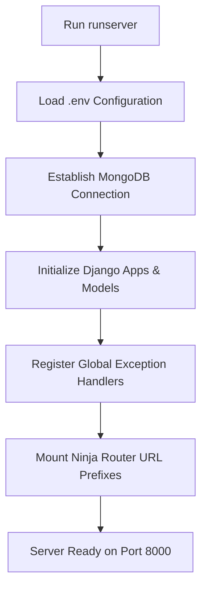

# Sales Intelligence Backend: Chronological Step-by-Step Guide

Welcome to the backend walkthrough! Since you have been working on the frontend, this guide is designed to explain **exactly what happens from scratch (step-by-step)** when the backend starts up, receives a request, processes it, and returns a response.

---

## Part 1: System Bootstrapping (From Cold Start)

Before any API request can be made, the backend initializes itself when you run `python manage.py runserver`:



### 1. Loading Configuration (`.env`)
* **What happens:** Django reads your `.env` file to fetch secrets and base URLs (like the MongoDB connection string `DATABASE_URL`, `GROQ_API_KEY`, and microservice endpoints for OCR, Web Agents, and RAG).
* **Why:** This ensures we don't hardcode sensitive API keys or local server URLs, allowing the application to transition easily between development and production.

### 2. Establishing MongoDB Connection
* **What happens:** Django uses the custom `django-mongodb-backend` settings configured in `config/settings.py` to open a connection pool to your MongoDB database.
* **Why:** Rather than traditional relational tables, our core intelligence datasets (past sales records, product catalogs, search logs) live in MongoDB for flexible schema handling.

### 3. Registering Exception Handlers & Routers
* **What happens:** In [config/urls.py](file:///d:/sdc_backend/config/urls.py), the `NinjaAPI` object is instantiated. It automatically registers:
  * Global exception handlers (e.g., how to format internal server errors vs. validation failures).
  * Modular routers (like `/ocr`, `/signals`, `/deals`, and `/company-analysis`).
* **Why:** This sets up a central gateway for all API requests, ensuring they are automatically routed, documented in Swagger, and wrapped in standard envelopes.

---

## Part 2: The Core Request Lifecycle (Step-by-Step Execution)

Here is the step-by-step chronology of what happens backend-side when a salesperson enters a company name on the dashboard and uploads a file.

### Step 1: Frontend Initiates Request
* **Action:** The frontend sends a `POST` request to `/api/company-analysis` with details like:
  ```json
  {
    "company_name": "Asian Paints",
    "website_url": "https://www.asianpaints.com",
    "question": "What is their strategic alignment?"
  }
  ```
  *(Along with an optional uploaded PDF or document brief)*.

### Step 2: Route Reception & Input Sanitation
* **Action:** The router receives the request and triggers `_parse_analysis_request()`. It extracts text fields and captures uploaded files.
* **Sanitation:** Before doing anything else, the service trims all strings and passes them through `clean_input_string()`, which escapes HTML characters (e.g., turning `<script>` into `&lt;script&gt;`).
* **Why:** This blocks cross-site scripting (XSS) attacks right at the entry point of our backend.

### Step 3: Document Text Extraction (OCR Service)
* **Action:** If the user uploaded files, the backend streams these files to the external OCR Microservice (`OCR_SERVICE_URL`).
* **Processing:** The OCR service scans the files and returns the extracted raw text.
* **Why:** Large PDF briefs or QBR decks contain rich context. Extracting the text lets the backend inject this raw document evidence directly into the LLM context.

### Step 4: Live Web Intelligence Scraping (Agent Service)
* **Action:** The backend queries the external **Web Agent Microservice** (`/question`) passing the company name and website URL.
* **Processing:** The Web Agent searches the live internet and returns scraped public data (recent acquisitions, news articles, CEO announcements).
* **Why:** Static internal databases don't know what happened yesterday. Web scraping adds real-time intelligence.

### Step 5: Querying Internal Databases (CRM & Deals)
* **Action:** The backend queries the local database to retrieve internal history:
  * **Company Collections:** Past sales and meeting records, proposals, and active customers from MongoDB.
  * **CRM Deals:** Standard pipeline values, opportunity histories, and close dates.
* **Why:** If we have already pitch-coached or closed a deal with this client, we want to combine that history with new web scraped data.

### Step 6: Keyword & RAG Question Generation (Groq Llama 3.1)
* **Action:** Before searching internal product catalogs, the backend calls Groq and asks it to generate:
  1. A list of search keywords.
  2. A natural-language question suitable for a vector search.
* **Input to LLM:** The company name, user question, scraped web news, and OCR extraction.
* **Why:** If a client has "emissions issues," we need to search our product database for "VOC reduction." Groq acts as a translator, turning the client's problem into search queries.

### Step 7: Matching Products & Case Studies (Vector RAG)
* **Action:** The backend queries two vector RAG services:
  * **Product RAG:** Returns top-relevant NovaChem products matching the generated question.
  * **Case-Study RAG:** Returns past successful case studies of similar clients.
* **Why:** Vector search finds products by *semantic meaning* (concepts) rather than exact keyword matches, identifying relevant solutions even if the names differ.

### Step 8: Context Compacting & Cleanup
* **Action:** The backend combines all gathered data (Web scrape, OCR text, CRM History, RAG Products, RAG Case Studies). It truncates oversized text and removes duplicate objects.
* **Why:** LLMs have strict token limits and can get confused by repetitive info. Compacting the prompt saves API costs and keeps the final analysis focused.

### Step 9: LLM Dashboard Synthesis (Groq JSON Prompt)
* **Action:** The backend calls Groq Chat Completions with a system prompt instructing the model to act as a senior enterprise sales analyst and return a **strict JSON object** matching the frontend dashboard schema.
* **Why:** This generates the core intelligence—calculating strategic fit, predicting AI needs, drafting recommended agendas, and highlighting objections.

### Step 10: Normalization & Error Correction Layer
* **Action:** The backend processes the LLM output. Since LLMs are sometimes unpredictable, the code applies safety logic:
  * **Product Alignment Check:** Ensures the LLM only suggests products that *actually exist* in our database (replaces fake names with real ones).
  * **Strategic Fit Calculation:** Evaluates if there is enough evidence. If fewer than 2 sources of evidence exist, the backend sets the strategic fit score to `null` and alignment level to `insufficient_evidence`.
  * **Deal Value Check:** Sets deal value to `null` if no CRM record explicitly mentions a currency amount, preventing fake prices.
* **Why:** Guarantees that the data displayed on the dashboard is verified, realistic, and trustworthy.

### Step 11: Validation (Pydantic Schema Enforcement)
* **Action:** The normalized dictionary is loaded into the Pydantic class `CompanyAnalysisResponseSchema`.
* **Why:** Pydantic throws a Python exception if any field is missing or contains the wrong data type, protecting the frontend from receiving corrupted JSON.

### Step 12: Saving Search History
* **Action:** The backend saves the analyzed company name, industry, fit score, and timestamp to the MongoDB `search_history` collection.
* **Why:** Populates the "Recent Searches" sidebar on the frontend, allowing salespeople to view past reports instantly without re-running the expensive LLM/scraping pipeline.

### Step 13: Sending Response Envelope
* **Action:** The backend wraps the final data inside the standard response envelope and sends it back to the client:
  ```json
  {
    "success": true,
    "data": { ... validated dashboard payload ... },
    "error": null,
    "timestamp": "2026-06-16T14:33:00Z"
  }
  ```
* **Why:** A standard envelope means the frontend only has to write one global interceptor to handle loading states, success screens, and error popups.

---

## Part 3: Cheat Sheet of Feature Rules

Here is a summary of the business logic enforced automatically by individual backend models:

| Feature | Rules & Constraints | Why It Matters |
| :--- | :--- | :--- |
| **Signals** | `title` and `source` are trimmed & escaped. Statuses must be: `NEW`, `PROCESSED`, or `ARCHIVED`. | Prevents bad data and layout breaking in the intent feed. |
| **Deals** | Changing stage to `CLOSED_WON` forces probability to `100`. Changing stage to `CLOSED_LOST` forces probability to `0`. | Standardizes sales pipeline math and forecasting. |
| **OCR** | Non-blocking if it fails on normal requests, but fatal if a file was uploaded and cannot be read. | Ensures the user knows if their file upload failed. |
| **RAG** | Treated as non-blocking. If RAG is down, the dashboard proceeds using fallback text. | Keeps the dashboard functional even if downstream RAG servers go offline. |
